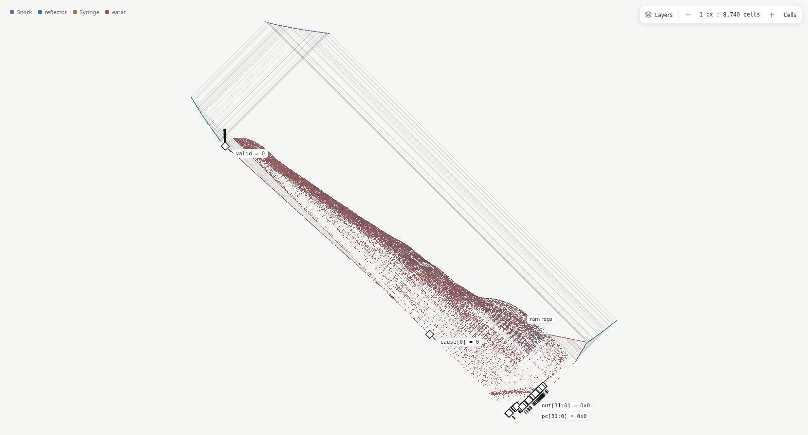

# Reusing columns to shorten the fabric

Baseline: `2f9ae18`, after the register-return bounds correction. Compare
[`return-loops-after.csv`](return-loops-after.csv) with
[`column-packing-after.csv`](column-packing-after.csv). The full 21-configuration
census is in [`column-packing-variants.csv`](column-packing-variants.csv).

## What changed

The placer previously advanced past the rightmost column of every block. Even
independent logic became one long diagonal strip, and every register returned
across that strip. Reusing rows alone could not shorten this flight.

The placer now tracks the rightmost occupied column separately for each routing
row. A block starts beyond the frontier over its input-to-output row span. Its
body reserves its full width, but the rows beneath it reserve only the narrow
input stems. Subsequent blocks can occupy the empty space beside those stems.
Register-Q ports are virtual launches and now share a column, while retaining
their required phase-sorted rows.

The frontier includes completed routes as well as components. Forgetting an
already-consumed wire would allow a new output to launch into an old obstacle.
Live output rows remain separately protected across all future columns; register-D
rows stay reserved for their trip to the perimeter. Existing crossing phases,
turn macros, complete delay footprints, and return-lane separation are retained.

Packing also changes the best topological order. Prioritizing wave phase is much
better for the large processors; prioritizing live-lane pressure remains better
for several small circuits. The compiler tries both and chooses the lower actual
**bounding-box area × clock period** after physical routing. Identical orders are
only built once. Each candidate passes the static design-rule check; if one cannot
be routed, the other can still be used. The logic, component counts, and static
cell counts are unchanged across the measured corpus.

## Results

Area is the axis-aligned core bounding-box area. Static counts exclude input tapes
and data-dependent moving gliders. Percentages below compare with `2f9ae18`, so
they are additional gains beyond the return-loop bounds fix.

| Example | Area | Generations/clock | Static live cells |
|---|---:|---:|---:|
| alu | -71.2% | -45.8% | unchanged |
| assembly | -58.4% | -34.6% | unchanged |
| blinker | -12.9% | -6.2% | unchanged |
| counter | -46.2% | -26.4% | unchanged |
| cpu | -72.1% | -46.8% | unchanged |
| full_adder | -25.0% | -11.5% | unchanged |
| half_adder | -4.0% | -4.0% | unchanged |
| lfsr | -52.5% | -28.8% | unchanged |
| popcount | -60.0% | -33.4% | unchanged |
| register_file | -48.2% | -28.8% | unchanged |
| ripple_adder | -36.3% | -17.9% | unchanged |
| riscv | -73.1% | -48.6% | unchanged |
| traffic_light | -51.7% | -26.5% | unchanged |

Across all 13 examples, geometric-mean reductions are **51.1% area** and
**29.0% generations/clock**. Every example improves both dimensions.

The RV32I demo changes from **14,374,124 × 13,965,392** to
**7,647,720 × 7,047,820** cells, and from **110,704,704 to 56,893,472
generations/clock**. It retains 25,294,236 static live cells and 413,527 components.
Its median register-return interval drops from **59,854,015 to 32,571,043
generations**. This is still 57.2% of the shorter clock: the global return journey
remains, but both the fabric and return paths are substantially shorter.

The external-memory `RV32I` top changes from 178,595,856 to **91,022,056
generations/clock**, with an **11,617,763 × 11,441,228** bounding box. It retains
39,990,460 static cells and 648,032 components.

Relative to main at `02ea123`, combining this change with the bounds fix gives
**85.5% less area and 62.8% fewer generations/clock for the demo**; the all-example
geometric-mean reductions are 70.9% and 45.2%, respectively.

There is a compilation cost: native demo compilation measured about **3.4 seconds**
versus 2.2 seconds before packing, and Chromium reported **5.2 seconds** versus
about 3.6 seconds. These are individual observations on this environment, not
controlled timing benchmarks. The search is bounded to two candidates.



## Alternatives tested

The CSV records all examples for every variant. Except for the final configuration,
each variation is isolated against `packed-v3`: narrow-stem reservations,
lane-pressure-first ordering, diagonal Q ports, and 32-consumer supply banks.
Changes below are geometric means relative to that experimental reference.

| Variant | Area | Period | Decision |
|---|---:|---:|---|
| Full-width routing-span reservations (`packed`) | +40.0% | +17.7% | Correct on audited designs, but wastes space beside stems; also used an extra column gap |
| Full-width reservations without extra gap (`packed-v2`) | +17.0% | +8.0% | Still too conservative |
| One Q column | -1.8% | -0.9% | Retained; no example regresses |
| Phase-first order | -7.0% | -3.9% | Retained as a candidate; alone it worsens counter area by 60.6% |
| FIFO order | +24.2% | +9.9% | Rejected |
| Lane pressure, then FIFO | +17.5% | +7.0% | Rejected |
| Lane pressure, then late phases | +34.9% | +15.6% | Rejected |
| Phase buckets of 4 | -1.8% | -1.3% | Weaker than phase-first overall |
| Phase buckets of 16–1024 | +7.7% to +17.5% | +2.9% to +7.0% | Rejected |
| Place outputs as soon as ready | -2.7% | -0.5% | Regresses some examples; small demo benefit (-0.4% area) |
| Also place ready register-D sinks, preserving Q order | -0.7% | +0.7% | Rejected |
| Supply banks of 8 | +8.8% | +2.0% | Also increases cells by 0.6% |
| Supply banks of 16 | +2.9% | approximately 0% | No useful overall improvement |
| Supply banks of 64 | -0.4% | approximately 0% | Cells +0.1%; retain 32 |
| Supply banks of 128 | -0.6% | -0.1% | Cells +0.3%; retain 32 |

Experimental environment switches were removed. The final configuration combines
narrow-stem packing, one Q column, and selection between the two useful orders.

## Validation

```sh
cargo test --release --workspace
cargo run --release -p goldl --example qor -- examples/*.goldl
for file in examples/*.goldl; do
  cargo run --release -p goldl-cli -- test "$file"
  cargo run --release -p goldl --example verify -- "$file" 4 47
done
cargo run --release -p goldl --example audit_routes -- examples/riscv.goldl
cargo run --release -p goldl --example audit_routes -- examples/riscv.goldl RV32I
cargo run --release -p goldl --example loop_stats -- examples/riscv.goldl
npm --prefix web run wasm
npm --prefix web run check
npm --prefix web run build
```

The new regression requires actual column overlap between independent logic blocks
in the population-count tree, then evolves the emitted pattern in Life with changing
inputs and after its input tape ends. Existing tests cover delayed and reconvergent
logic, different register launch phases, and constant-zero register writes.

All **73 active Rust tests** and **15 source testbenches** pass. All 13 examples
pass four full Life clocks, with exact cell agreement at eight half-cycle snapshots.
The demo reaches generation **227,573,901**, checking approximately 25.3 million
live cells. The full ISA/program regressions are logical tests; the Life run covers
four clocks, not the complete Fibonacci program.

The demo audit passes 823,509 candidate static interactions and 7,427 return legs;
the external-memory core passes 1,298,529 interactions and 9,550 return legs.
WASM, TypeScript, production web build, and Chromium demo compilation/rendering
also pass.

Reviewing the UI integration exposed an old monotonic-placement assumption in
group bounds: a consecutive run only expanded its maximum coordinates. Packed
blocks can move left or down, so the run must also expand its minimum coordinates.
The regression reproduced a missing block in the population-count group's bounds
before the fix, and now checks that every logic block is enclosed. Group framing
therefore includes the packed logic.

The remaining architectural limit is global feedback around a one-way fabric.
Local feedback, folding, or a different logic-cell family could improve it further,
but would require new routing and collision arguments. This is a bounded placement
improvement, not a claim of globally optimal Life circuitry.
