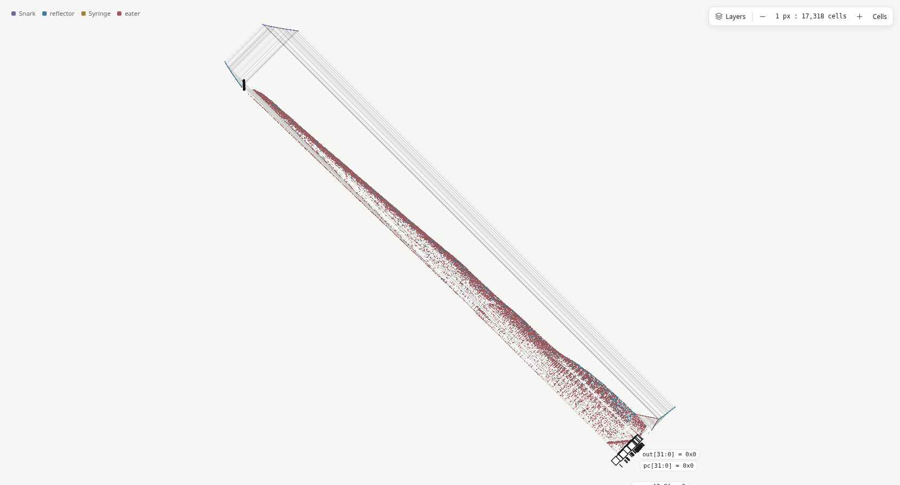

# Shorter register return paths

These are the measurements for the bounds-only revision. The subsequent
[column-packing experiment](column-packing.md) reduces the fabric itself further.

Baseline: `02ea123` on main, including the assembly examples. Compare
[`return-loops-before.csv`](return-loops-before.csv) with
[`return-loops-after.csv`](return-loops-after.csv). This is a follow-up to the
[earlier mapping and layout experiments](README.md).

## Cause and correction

The return router enclosed the whole fabric in an x/y bounding rectangle, then
rotated that rectangle into routing coordinates `u = x + y`, `v = x - y`. This is
very loose for a narrow diagonal circuit. A line from `(0, 0)` to `(L, L)` has
`v = 0`, but rotating its x/y bounding rectangle produces `v` bounds of `-L` to
`+L`. Every register was sent around that artificial enclosure.

The router now bounds each component and finite glider-flight endpoint directly
in u/v coordinates. Register-D routes and their side-output eaters are emitted
before measuring the fabric; these deferred routes were previously absent from
the bounds and can extend past the ordinary outputs. Each component's own x/y
box remains a conservative bound on its cells.

The top clearance is two grid cells, with the existing per-register offsets and
lane/phase separation retained. Clearances 0, 1, 2, 4, 6, and 8 were tried. Zero
fails return-loop construction on Glider-8. One compiles the example corpus; two
keeps an extra grid cell of clearance at negligible cost on large designs. Two
is the physically validated default.

## Results

Area is the axis-aligned core bounding-box area. Counts exclude input tapes and
data-dependent moving gliders. These gains come from shortening empty flight;
**static cell counts and component counts are unchanged on every example**.

| Example | Area | Generations/clock | Static live cells |
|---|---:|---:|---:|
| alu | -50.5% | -29.4% | 0% |
| assembly | -42.0% | -22.9% | 0% |
| blinker | -13.0% | -7.4% | 0% |
| counter | -41.0% | -23.5% | 0% |
| cpu | -46.1% | -27.7% | 0% |
| full_adder | -40.9% | -20.5% | 0% |
| half_adder | -44.0% | -21.4% | 0% |
| lfsr | -37.1% | -22.0% | 0% |
| popcount | -41.7% | -22.3% | 0% |
| register_file | -42.1% | -24.3% | 0% |
| ripple_adder | -42.2% | -24.9% | 0% |
| riscv | -46.1% | -27.7% | 0% |
| traffic_light | -32.2% | -20.9% | 0% |

Across all 13 examples, the geometric-mean reductions are **40.5% area** and
**22.8% generations per clock**. The RV32I demo changes from
**19,671,681 × 18,921,711** to **14,374,124 × 13,965,392** cells and from
**153,085,160 to 110,704,704 generations/clock**: 46.1% less area and 27.7% less
time per clock, with the same 25,294,236 static live cells and 413,527 components.

The `loop_stats` diagnostic measures each register's return interval, including
reflection/timing reactions and constant-supply registers. The median interval
falls from **102,234,471 generations (66.8% of a clock)** to
**59,854,015 generations (54.1%)**. The remaining register journey still spans
most of the one-way fabric: registers launch at one end and collect their next
state at the other. Local feedback or folded placement could reduce that remaining
distance; neither is implemented by this bounds correction.

The browser overview after compaction:



## Reproduction and validation

```sh
cargo run --release -p goldl --example qor -- examples/*.goldl
cargo run --release -p goldl --example loop_stats -- examples/riscv.goldl
cargo test --release --workspace
cargo build --release -p goldl-cli
for file in examples/*.goldl; do
  target/release/goldl test "$file"
  cargo run --release -p goldl --example verify -- "$file" 4 31
done
cargo run --release -p goldl --example audit_routes -- examples/riscv.goldl
cargo run --release -p goldl --example audit_routes -- examples/riscv.goldl RV32I
```

A focused regression checks long diagonal rows and columns, including an input
tape with an unbounded starting time: their perpendicular routing extent must
remain narrow. The existing standalone tests exercise the deferred register-D
routes. The route audits check free flight against static components and return
crossings across neighboring clocks; complete Life simulation checks actual
component reactions and data-dependent gliders.

All **72 active Rust tests** and **15 source testbenches** pass. All 13 examples
pass four complete Life clocks with exact cell agreement at half-cycle snapshots.
For the RV32I demo this reaches generation **442,818,829**, checking approximately
25.3 million live cells. The full ISA/program regressions remain logical tests;
this run evolves four clocks in Life, not the entire Fibonacci program.

The demo route audit passes 823,509 candidate static interactions and 7,427 return
legs. The external-memory RV32I core passes 1,298,529 candidate static interactions
and 9,550 return legs. It compiles to 22,564,488 × 22,480,266 cells,
178,595,856 generations/clock, and 39,990,460 static live cells.

WASM compilation, TypeScript checking, production web build, and Chromium checks
pass. The browser compiles the demo in about 3.6 seconds and renders the tighter
enclosure; all 13 example names/counts remain clear at desktop, tablet and phone
widths. The compiler PR's Rust and web CI jobs pass.
